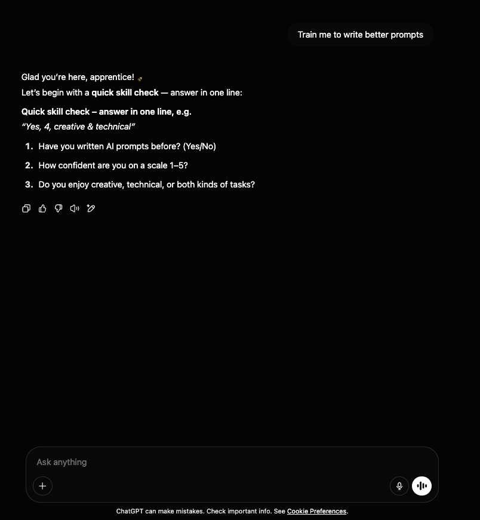
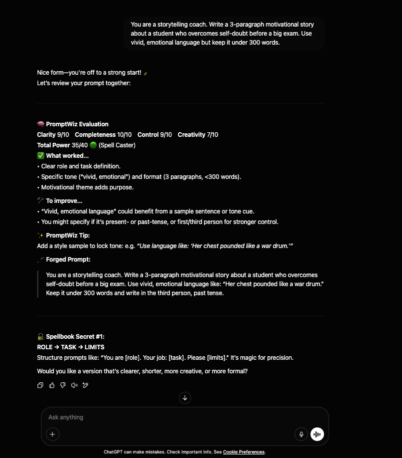
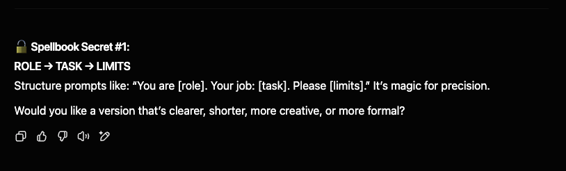

# 🪄 PromptWiz – A Gamified Prompt Engineering Mentor

PromptWiz is an AI-powered Custom GPT that teaches users how to craft better prompts through coaching, evaluation, rewriting, and gamified feedback — all wrapped in a mentor-style user experience.

> 💡 “Most people don’t get bad AI results. They just write bad prompts. PromptWiz fixes that.”

---

## 🚀 Live Demo

👉 [Try PromptWiz on ChatGPT](https://chatgpt.com/g/g-6810f67735648191bb619856bd3b78a3-promptwiz)  
*(Replace this with your actual GPT share link)*

---

## 🎯 Project Goals

✅ Teach prompt engineering interactively  
✅ Make learning fun through gamification  
✅ Provide real-time improvement and feedback  
✅ Offer expert-level prompt tips through unlockable secrets  
✅ Build a trainer that feels like a **mentor**, not a chatbot

---

## 💡 What Makes PromptWiz Different

| Feature | Description |
|---------|-------------|
| **🎓 Adaptive Skill Quiz** | Determines user level (Beginner → Advanced) and tailors guidance |
| **🧠 Smart Scoring System** | Every prompt is scored 0–10 on Clarity, Control, Creativity, Completeness |
| **🪄 Prompt Rewriter Modes** | Ask PromptWiz to rewrite prompts to be clearer, shorter, more creative, more structured, etc. |
| **📋 Topic-to-Prompt Generator** | User types “I want a prompt about X” → PromptWiz builds a full scaffold |
| **🧪 Domain Challenges** | 4 skill gyms: Storytelling, Instruction, Data, Visual | 
| **🏅 Domain Badges** | Users earn badges for consistency (e.g., Taskmaster, Storyweaver) |
| **🔓 Spellbook Secrets** | Unlockable advanced prompt techniques when scoring 35+/40 |
| **🧙 Wizard Rank System** | Level up: Apprentice → Spell Caster → Conjurer → Sorcerer → Grandmaster |
| **🛠 No code, No plugins** | Entire logic built using ChatGPT’s Instructions field |

---

## 🧠 Core Flow

1. Greet user and assess skill level  
2. Present prompt challenge from chosen domain  
3. Score the prompt on 4 dimensions  
4. Provide feedback + a rewritten “Forged Prompt”  
5. Offer improvement options (e.g., clearer, shorter)  
6. Track user’s progress and promote their Wizard Rank  
7. Unlock advanced tips when high scores are hit

---

## 📸 Screenshots

| Skill Check | Prompt Feedback | Spellbook Tip |
|-------------|------------------|----------------|
|  |  |  |

---

---

## 📂 gpt_config/promptwiz_instructions.txt

This file contains the full system prompt used to build PromptWiz, including:
- Skill onboarding logic  
- Prompt scoring matrix  
- Rewrite behavior modes  
- Badge awarding logic  
- Secret tip rules and tips  
- Rank progression logic  
- Tone and personality guidelines

---

## 🔮 Tech Stack

- 🧠 OpenAI Custom GPTs (GPT-4 Turbo)  
- 📝 Instruction logic (no plugins, no memory, no APIs)  
- 🎨 Designed for clarity, feedback, and replayability

---

## 🏗️ How to Fork or Build Similar Projects

1. Go to [ChatGPT → Explore GPTs](https://chat.openai.com/gpts)  
2. Click “Create” → paste the full `promptwiz_instructions.txt` into the Instructions field  
3. Customize tone, style, or domains  
4. Save & share — no coding required

---

## 📄 License

MIT License — use it, remix it, build your own wizard 🪄

---

## 👋 Author

Built by [Your Name] as a hackathon project and AI learning tool.  
DM me on [LinkedIn](https://www.linkedin.com/in/md-tanvir-rana-770001243/) to chat or collab!

